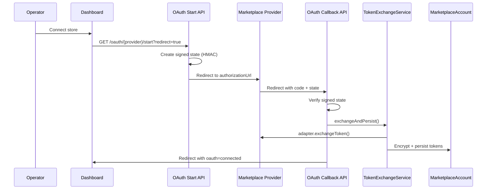

# Marketplace OAuth Lifecycle

Marketplace OAuth is operationally complex because each provider uses different authorization flows, token formats, refresh semantics, and failure modes — while operators expect a single consistent dashboard experience.

This document describes the OAuth and token management architecture built on `MarketplaceAccount`.

## Flow overview



## Signed OAuth state (CSRF protection)

State is a **signed, self-contained token** — not an in-memory lookup:

- Payload: `userId`, `provider`, `mode` (`connect` | `reconnect`), `accountId?`, `returnUrl`, `exp`, `nonce`
- Signed with HMAC-SHA256 using `MARKETPLACE_OAUTH_STATE_SECRET` (falls back to `MARKETPLACE_ENCRYPTION_SECRET`)
- TTL: 10 minutes
- Verified on callback before token exchange

Implementation: `utils/oauth-state-token.ts`, `services/oauth-state.service.ts`

## Provider config registry

Centralized in `providers/config/provider-config.registry.ts`:

| Provider  | Auth URL                 | Token URL                    | Env credentials                                  |
| --------- | ------------------------ | ---------------------------- | ------------------------------------------------ |
| Shopee    | partner.shopeemobile.com | auth/token/get               | `SHOPEE_PARTNER_ID`, `SHOPEE_PARTNER_KEY`        |
| Tokopedia | accounts.tokopedia.com   | accounts.tokopedia.com/token | `TOKOPEDIA_CLIENT_ID`, `TOKOPEDIA_CLIENT_SECRET` |

Redirect URI: `{MARKETPLACE_OAUTH_CALLBACK_BASE_URL}/api/v1/marketplaces/oauth/{provider}/callback`

## Service boundaries

| Service                           | Responsibility                                         |
| --------------------------------- | ------------------------------------------------------ |
| `MarketplaceOAuthService`         | Start flow, complete callback orchestration            |
| `MarketplaceTokenExchangeService` | Exchange code → validate → encrypt → persist           |
| `MarketplaceTokenRefreshService`  | Refresh tokens, batch expiring accounts (BullMQ-ready) |
| `MarketplaceAccountService`       | Manual connect/reconnect/disconnect                    |
| Provider adapters                 | HTTP to provider APIs only — no Prisma                 |

**Token exchange never lives in API routes or UI.**

## Reconnect lifecycle

Reconnect preserves:

- `externalStoreId` (store linkage)
- Account record (soft disconnect only)
- Future variant mappings (via same account ID)

Modes:

1. **OAuth reconnect** — `mode: reconnect` in signed state, `accountId` in payload
2. **Manual reconnect** — existing modal/API with new tokens

On validation failure: status → `RECONNECT_REQUIRED`, metadata records `lastValidationError`.

## Token refresh architecture

`MarketplaceTokenRefreshService`:

- `refreshAccountTokens(accountId)` — single account refresh
- `findAccountsExpiringBefore()` — query helper for workers
- `refreshExpiringAccounts({ batchSize, dryRun })` — batch entry point

BullMQ (prepared, not scheduled):

- Queue: `MARKETPLACE_TOKEN_REFRESH`
- Job: `REFRESH_MARKETPLACE_TOKENS`

After 3 refresh failures → `RECONNECT_REQUIRED`.

## Account health

`resolveAccountHealth()` tracks:

- Token expiration / expiring soon
- Refresh failure count (from metadata)
- `lastValidatedAt`, `lastRefreshAt`
- Auto-reconciled status (`EXPIRED` when past `tokenExpiresAt`)

## Disconnect lifecycle

Soft disconnect:

- Status → `DISCONNECTED`
- Refresh token cleared locally
- Access token retained (encrypted) for audit — not exposed to UI
- `metadata.disconnectedAt` recorded

## API routes

| Route                            | Purpose                                       |
| -------------------------------- | --------------------------------------------- |
| `GET /oauth/{provider}/start`    | Create state, return or redirect to auth URL  |
| `GET /oauth/{provider}/callback` | Verify state, exchange, redirect to dashboard |
| `GET /oauth/status`              | Provider OAuth configuration status           |
| `POST /{id}/reconnect`           | Manual token reconnect                        |

## Operator-facing errors

`MarketplaceError` includes `operatorMessage` for dashboard-friendly copy:

- `OAUTH_STATE_EXPIRED` — restart connect flow
- `PROVIDER_EXCHANGE_FAILED` — provider rejected authorization
- `RECONNECT_REQUIRED` — store needs re-authorization

## Why this matters operationally

Operators manage multiple stores across providers. When a token expires at 2am, they need:

1. Clear dashboard indication (not a stack trace)
2. One-click OAuth reconnect preserving store identity
3. Audit trail of connect/reconnect/disconnect events

This architecture separates provider HTTP quirks from account lifecycle logic so adding TikTok Shop or Lazada is adapter work — not a dashboard rewrite.

## Environment variables

```env
SHOPEE_PARTNER_ID=
SHOPEE_PARTNER_KEY=
TOKOPEDIA_CLIENT_ID=
TOKOPEDIA_CLIENT_SECRET=
MARKETPLACE_ENCRYPTION_SECRET=   # required, min 32 chars
MARKETPLACE_OAUTH_STATE_SECRET=  # optional, defaults to encryption secret
MARKETPLACE_OAUTH_CALLBACK_BASE_URL=  # optional, defaults to AUTH_URL / NEXT_PUBLIC_APP_URL
```
